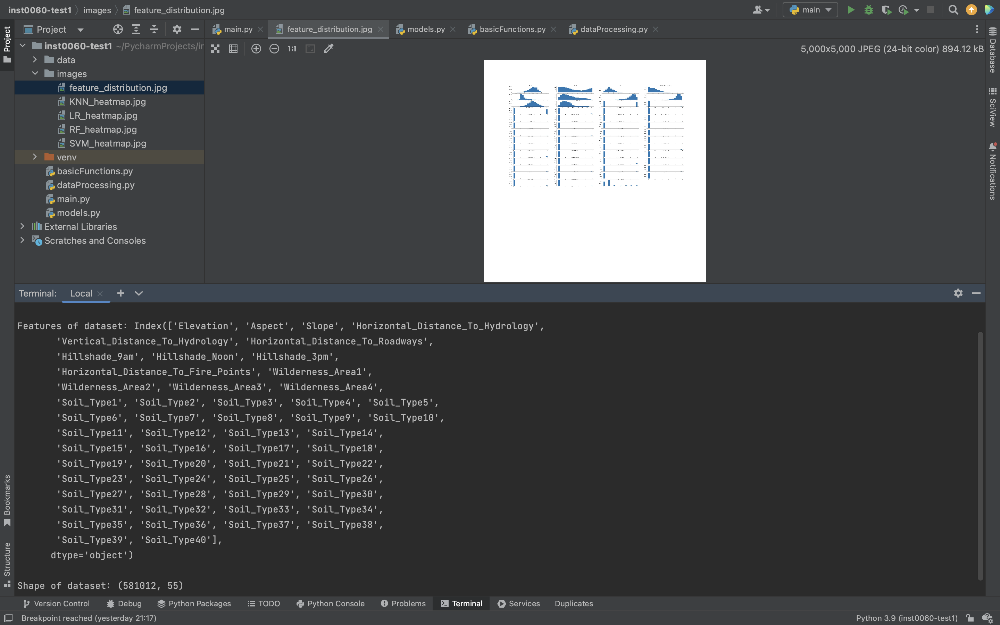
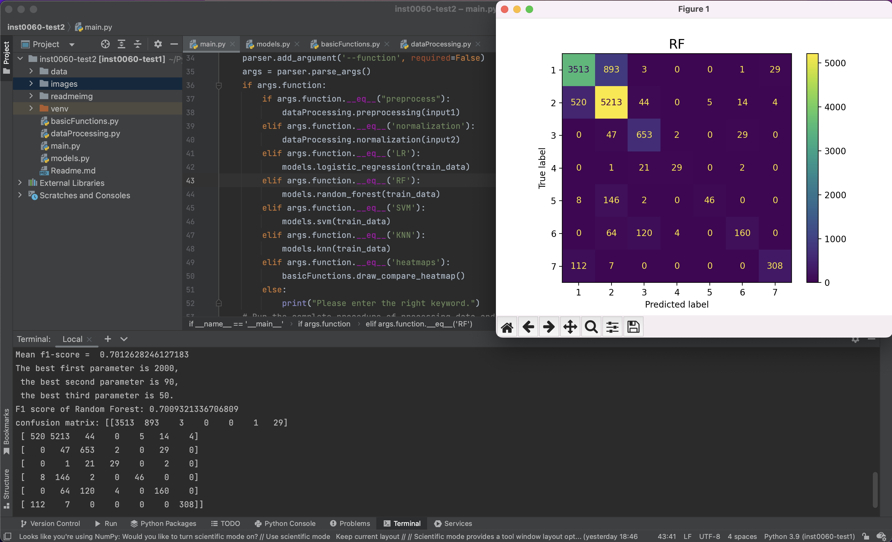

# Readme

# Project: Comparison of Machine Learning Models

In this project, four classification models are involved, which are Logistic Rrgression(LR), Random Forest (RF), Support Vector Machine (SVM) and K-Nearest Neighbor (KNN). They will predict the types of trees grown in an area based on the surrounding characteristics such as tree type and shadow coverage. The performance of different models will be analysed by macro F1 scores.

## Version Control

If you are using the version **python**, please use “python” instead of “python3” in the following to run the program in the PyCharm terminal.

If you are using ther version **python3**, please follow the usage example to run the program.

## Getting Start

The code is divided into 4 sections, which are main.py, models.py, basicFunctions.py and dataProcessing.py. There are two folders: data and images, which will respectively store the data used and images generated from the code.

### Prerequisites

This project is compiled in PyCharm and applies Python libraries, including `argparse`, `pandas`, `numpy`, `sklearn.metrics`, `matplotlib`, `sklearn.linear_model`, `sklearn.ensemble`, `sklearn.svm`, `sklearn.neighbors`,`warnings`.

### Function description

This part will describe the overall function of each module. Arguments for each function will be explicitly introduced in the code.

- main.py
    
    Allow the user to run the whole code (including the training process of four classification models, showing the barchart of f1-score of the four models, showing the combined heatmaps of the four models) or run each function separately.
    
- models.py
    
    Contain the four classification models, once called, it will output all f1-scores from each fold of the Cross-Validation, the final f1-score obtained from running the model on the test data
    and the heatmap of the final result of this model. For the model with Grid Search (to tune and find the best hyperparameters), it will additionally output the best parameters used in the final train and test.
    
- basicFunctions.py
    
    Contain 6 functions: `train_test_split`, `check_parameters`, `cross_validation`, `draw_heatmap`, `draw_comparison`, `draw_compare_heatmap`
    
    > train_test_split(X, y, test_ratio=0.3, seed=seed) is used to return four dataframe-data respectively stand for features of the training data, labels of the training data, features of the testing data, labels of the testing data.
    > 
    
    > check_parameters(gridPara) is used to return lists of parameters needed to be tuned.
    > 
    
    > cross_validation(f1_overall, folds, input, model, count) is used to all f1-scores computed by the Cross Validation.
    > 
    
    > draw_heatmap(model, model_confusion, target, result) is used to draw the corresponding heat-map of the model and save the image in folder “images”.
    > 
    
    > draw_comparison(all_f1_score) is used to draw the bar chart which shows the f1-score of the four models and save the image in folder “images”.
    > 
    
    > draw_compare_heatmap() is used to draw the picture that combines the four heatamaps of the four models and save the image in folder “images”.
    > 
- dataProcessing.py
    
    Contain 2 functions: `preprocessing`, `normalization`.
    
    > preprossing(data) is used to sample 40000 data points from the original 581012 data points. Each class is ensure to remain the original ratio from the total dataset.
    > 
    
    > normalization(data) is used to normalize the data.
    > 
    

### Usage example

The code can be activated from terminal. The code allows each module to run individually. 

**Run the main.py to see results of four models**

```python
click the "Run 'main'" on the top to start the program.
```


Based on the test data, it will output the final f1-score, the confusion matrix and the heat-map of each model, which is trained on the train data. Furthermore, Grid Search is applied to tune hyperparameters of each model. To show the process of tuning hyperparameters and control the running time, only RF’s process of Grid Search is runed and printed. Moreover, to make it clear that hyperparameters of each model is tuned, the process of Grid Search is commented in the models.py.

**Run Data Preprocessing by keying in “preprocessing” in terminal**

```python
python3 main.py --function preprocess
```



The code will output all features of the data, the quantity of each class and save the generated “40000_data.csv” in folder “data”. An image of the distribution of each feature and an image of the quantity of each class will also be ploted and saved.

**Run Data Normalization by keying in “normalization” in terminal**

```python
python3 main.py --function normalization
```


The code will output the sentense saying that data is successfully normalized and save the generated “normalized_data.csv” in folder “data”.

**Run Model RF by keying in “RF” in terminal**

```python
python3 main.py --function RF
```



For different hyperparameters, the code will output the f1-score of each fold of Cross Validation. After deciding the best parameters, the code will train and test the model on the test data to output the final f1-score, confusion matrix and heat-map.

**Run Model LR**

```python
python3 main.py --function LR
```


LR, SVM and KNN will have the similar output, therefore in this file only LR will be demonstrated. Unlike RF, the Grid Search process of LR will not be shown, hence the model is set with the best hyperparameteres and will be trained and tested on the test data to output the final f1-score, confusion matrix and heat-map.

## Authors and Contributions

- 22049159 - responsible for SVM, assigning tasks and writing Data Normalization
- 22073458 - responsible for LR, combining codes, writing Data Split and writing Readme.md
- 19112276 - responsible for KNN, writing Cross Validation and writing Data Preprocessing
- 22033010 - responsible for RF and writing Grid Search